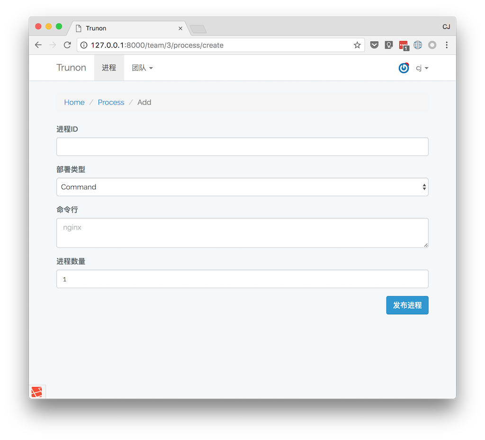

TRUNON
=======

TRUNON帮助你用网页管理服务进程，包括启动、修改和重启删除进程等。可以在进程中查看日志。进程管理基于supervisor这个python开发的进程管理工具。

## 截图



## 安装

在终端执行 `sh RUN` 或者 `./RUN` 可以配置并运行TRUNON。

```
git clone https://github.com/imcj/trunon.git
cd trunon
./RUN
```

## 依赖

- python
- supervisor
- php
- php5_sqlite

TRUNON使用`supervisor`管理进程，在supervsiro的基础上提供web界面。

## Docker

docker的开发环境，已经安装好了`php5` `python` `supervisor`等必需的组件。

`docker run -t -i weicongju/trunon`

## 安装 Supervisord

```
pip install supervisor
```
