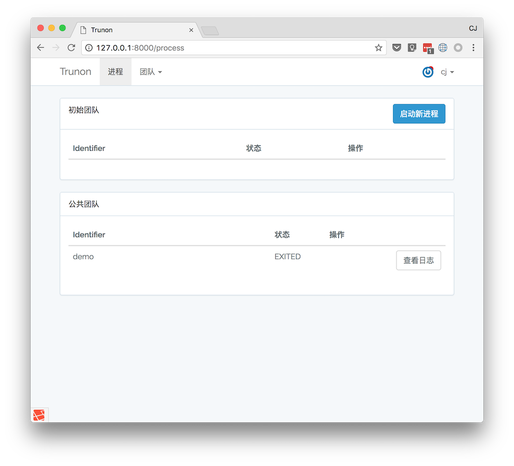
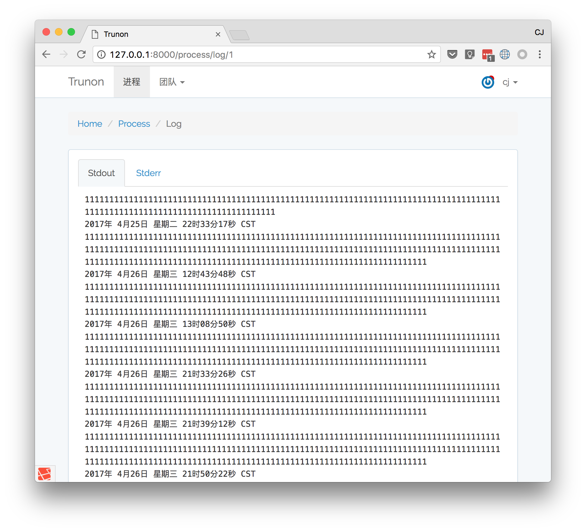

TRUNON
=======

TRUNON帮助你用网页管理服务进程，包括启动、修改和重启删除进程等。还可以在进程中查看日志。TRUNON的进程管理基于supervisor这个python开发的进程管理工具。

## 截图





## 依赖

- python
- supervisor
- php
- php5_sqlite

TRUNON使用`supervisor`管理进程，在supervsiro的基础上提供web界面。

## 安装

在终端执行 `sh RUN` 或者 `./RUN` 可以配置并运行TRUNON。

```
git clone https://github.com/imcj/trunon.git
cd trunon
./RUN
```

## 安装 Supervisord

```
pip install supervisor
```
